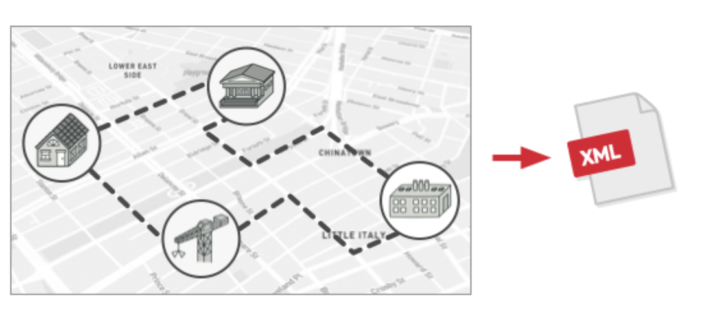

亦称： Visitor

意图
--

**访问者**是一种行为设计模式，它能将算法与其所作用的对象隔离开来。


问题
--

假如你的团队开发了一款能够使用巨型图像中地理信息的应用程序。图像中的每个节点既能代表复杂实体（例如一座城市），也能代表更精细的对象（例如工业区和旅游景点等）。如果节点代表的真实对象之间存在公路，那么这些节点就会相互连接。在程序内部，每个节点的类型都由其所属的类来表示，每个特定的节点则是一个对象。



将图像导出为 XML。

一段时间后，你接到了实现将图像导出到 XML 文件中的任务。这些工作最初看上去非常简单。你计划为每个节点类添加导出函数，然后递归执行图像中每个节点的导出函数。解决方案简单且优雅：使用多态机制可以让导出方法的调用代码不会和具体的节点类相耦合。

但你不太走运，系统架构师拒绝批准对已有节点类进行修改。他认为这些代码已经是产品了，不想冒险对其进行修改，因为修改可能会引入潜在的缺陷。


所有节点的类中都必须添加导出至 XML 文件的方法，但如果在修改代码的过程中引入了任何缺陷，那么整个程序都会面临风险。

此外，他还质疑在节点类中包含导出 XML 文件的代码是否有意义。这些类的主要工作是处理地理数据。导出 XML 文件的代码放在这里并不合适。

还有另一个原因，那就是在此项任务完成后，营销部门很有可能会要求程序提供导出其他类型文件的功能，或者提出其他奇怪的要求。这样你很可能会被迫再次修改这些重要但脆弱的类。

解决方案
----

访问者模式建议将新行为放入一个名为​_访问者_​的独立类中，而不是试图将其整合到已有类中。现在，需要执行操作的原始对象将作为参数被传递给访问者中的方法，让方法能访问对象所包含的一切必要数据。

如果现在该操作能在不同类的对象上执行会怎么样呢？比如在我们的示例中，各节点类导出 XML 文件的实际实现很可能会稍有不同。因此，访问者类可以定义一组（而不是一个）方法，且每个方法可接收不同类型的参数，如下所示：

```
class ExportVisitor implements Visitor is
    method doForCity(City c) { ... }
    method doForIndustry(Industry f) { ... }
    method doForSightSeeing(SightSeeing ss) { ... }
    


```

但我们究竟应该如何调用这些方法（尤其是在处理整个图像方面）呢？这些方法的签名各不相同，因此我们不能使用多态机制。为了可以挑选出能够处理特定对象的访问者方法，我们需要对它的类进行检查。这是不是听上去像个噩梦呢？

```
foreach (Node node in graph)
    if (node instanceof City)
        exportVisitor.doForCity((City) node)
    if (node instanceof Industry)
        exportVisitor.doForIndustry((Industry) node)
    
}


```

你可能会问，我们为什么不使用方法重载呢？就是使用相同的方法名称，但它们的参数不同。不幸的是，即使我们的编程语言（例如 Java 和 C#）支持重载也不行。由于我们无法提前知晓节点对象所属的类，所以重载机制无法执行正确的方法。方法会将`节点`基类作为输入参数的缺省类型。

但是，访问者模式可以解决这个问题。它使用了一种名为[双分派](https://refactoringguru.cn/design-patterns/visitor-double-dispatch "Visitor and Double Dispatch")的技巧，不使用累赘的条件语句也可下执行正确的方法。与其让客户端来选择调用正确版本的方法，不如将选择权委派给作为参数传递给访问者的对象。由于该对象知晓其自身的类，因此能更自然地在访问者中选出正确的方法。它们会 “接收” 一个访问者并告诉其应执行的访问者方法。

```
// 客户端代码
foreach (Node node in graph)
    node.accept(exportVisitor)

// 城市
class City is
    method accept(Visitor v) is
        v.doForCity(this)
    

// 工业区
class Industry is
    method accept(Visitor v) is
        v.doForIndustry(this)
    


```

我承认最终还是修改了节点类，但毕竟改动很小，且使得我们能够在后续进一步添加行为时无需再次修改代码。

现在，如果我们抽取出所有访问者的通用接口，所有已有的节点都能与我们在程序中引入的任何访问者交互。如果需要引入与节点相关的某个行为，你只需要实现一个新的访问者类即可。

真实世界类比
------


一位优秀的保险代理人总能为不同类型的团体提供不同的保单。

假如有这样一位非常希望赢得新客户的资深保险代理人。他可以拜访街区中的每栋楼，尝试向每个路人推销保险。所以，根据大楼内组织类型的不同，他可以提供专门的保单：

*   如果建筑是居民楼，他会推销医疗保险。
*   如果建筑是银行，他会推销失窃保险。
*   如果建筑是咖啡厅，他会推销火灾和洪水保险。

结构
--

1.  **访问者**（Visitor）接口声明了一系列以对象结构的具体元素为参数的访问者方法。如果编程语言支持重载，这些方法的名称可以是相同的，但是其参数一定是不同的。
    
2.  **具体访问者**（Concrete Visitor）会为不同的具体元素类实现相同行为的几个不同版本。
    
3.  **元素**（Element）接口声明了一个方法来 “接收” 访问者。该方法必须有一个参数被声明为访问者接口类型。
    
4.  **具体元素**（Concrete Element）必须实现接收方法。该方法的目的是根据当前元素类将其调用重定向到相应访问者的方法。请注意，即使元素基类实现了该方法，所有子类都必须对其进行重写并调用访问者对象中的合适方法。
    
5.  **客户端**（Client）通常会作为集合或其他复杂对象（例如一个[组合](https://refactoringguru.cn/design-patterns/composite "组合")树）的代表。客户端通常不知晓所有的具体元素类，因为它们会通过抽象接口与集合中的对象进行交互。
    

伪代码
---

在本例中，**访问者**模式为几何图像层次结构添加了对于 XML 文件导出功能的支持。


通过访问者对象将各种类型的对象导出为 XML 格式文件。

```
// 元素接口声明了一个`accept`（接收）方法，它会将访问者基础接口作为一个参
// 数。
interface Shape is
    method move(x, y)
    method draw()
    method accept(v: Visitor)

// 每个具体元素类都必须以特定方式实现`accept`方法，使其能调用相应元素类的
// 访问者方法。
class Dot extends Shape is
    

    // 注意我们正在调用的`visitDot`（访问点）方法与当前类的名称相匹配。
    // 这样我们能让访问者知晓与其交互的元素类。
    method accept(v: Visitor) is
        v.visitDot(this)

class Circle extends Dot is
    
    method accept(v: Visitor) is
        v.visitCircle(this)

class Rectangle extends Shape is
    
    method accept(v: Visitor) is
        v.visitRectangle(this)

class CompoundShape implements Shape is
    
    method accept(v: Visitor) is
        v.visitCompoundShape(this)


// 访问者接口声明了一组与元素类对应的访问方法。访问方法的签名能让访问者准
// 确辨别出与其交互的元素所属的类。
interface Visitor is
    method visitDot(d: Dot)
    method visitCircle(c: Circle)
    method visitRectangle(r: Rectangle)
    method visitCompoundShape(cs: CompoundShape)

// 具体访问者实现了同一算法的多个版本，而且该算法能与所有具体类进行交互。
//
// 访问者模式在复杂对象结构（例如组合树）上使用时能发挥最大作用。在这种情
// 况下，它可以存储算法的一些中间状态，并同时在结构中的不同对象上执行访问
// 者方法。这可能会非常有帮助。
class XMLExportVisitor implements Visitor is
    method visitDot(d: Dot) is
        // 导出点（dot）的 ID 和中心坐标。

    method visitCircle(c: Circle) is
        // 导出圆（circle）的 ID 、中心坐标和半径。

    method visitRectangle(r: Rectangle) is
        // 导出长方形（rectangle）的 ID 、左上角坐标、宽和长。

    method visitCompoundShape(cs: CompoundShape) is
        // 导出图形（shape）的 ID 和其子项目的 ID 列表。


// 客户端代码可在不知晓具体类的情况下在一组元素上运行访问者操作。“接收”操
// 作会将调用定位到访问者对象的相应操作上。
class Application is
    field allShapes: array of Shapes

    method export() is
        exportVisitor = new XMLExportVisitor()

        foreach (shape in allShapes) do
            shape.accept(exportVisitor)


```

如果你并不十分理解为何本例中需要使用`接收`（accept）方法，我的一篇文章 [Visitor and Double Dispatch](https://refactoringguru.cn/design-patterns/visitor-double-dispatch) 详细解释了这个问题。

适用性
---

如果你需要对一个复杂对象结构（例如对象树）中的所有元素执行某些操作，可使用访问者模式。

访问者模式通过在访问者对象中为多个目标类提供相同操作的变体，让你能在属于不同类的一组对象上执行同一操作。

可使用访问者模式来清理辅助行为的业务逻辑。

该模式会将所有非主要的行为抽取到一组访问者类中，使得程序的主要类能更专注于主要的工作。

当某个行为仅在类层次结构中的一些类中有意义，而在其他类中没有意义时，可使用该模式。

你可将该行为抽取到单独的访问者类中，只需实现接收相关类的对象作为参数的访问者方法并将其他方法留空即可。

实现方式
----

1.  在访问者接口中声明一组 “访问” 方法，分别对应程序中的每个具体元素类。
    
2.  声明元素接口。如果程序中已有元素类层次接口，可在层次结构基类中添加抽象的 “接收” 方法。该方法必须接受访问者对象作为参数。
    
3.  在所有具体元素类中实现接收方法。这些方法必须将调用重定向到当前元素对应的访问者对象中的访问者方法上。
    
4.  元素类只能通过访问者接口与访问者进行交互。不过访问者必须知晓所有的具体元素类，因为这些类在访问者方法中都被作为参数类型引用。
    
5.  为每个无法在元素层次结构中实现的行为创建一个具体访问者类并实现所有的访问者方法。
    
    你可能会遇到访问者需要访问元素类的部分私有成员变量的情况。在这种情况下，你要么将这些变量或方法设为公有，这将破坏元素的封装；要么将访问者类嵌入到元素类中。后一种方式只有在支持嵌套类的编程语言中才可能实现。
    
6.  客户端必须创建访问者对象并通过 “接收” 方法将其传递给元素。
    

优缺点
---

*   [开闭原则]。你可以引入在不同类对象上执行的新行为，且无需对这些类做出修改。
*   [单一职责原则]。你可将同一行为的不同版本移到同一个类中。
*   访问者对象可以在与各种对象交互时收集一些有用的信息。当你想要遍历一些复杂的对象结构（例如对象树），并在结构中的每个对象上应用访问者时，这些信息可能会有所帮助。

*   每次在元素层次结构中添加或移除一个类时，你都要更新所有的访问者。
*   在访问者同某个元素进行交互时，它们可能没有访问元素私有成员变量和方法的必要权限。

与其他模式的关系
--------

*   你可以将[访问者](https://refactoringguru.cn/design-patterns/visitor)视为[命令](https://refactoringguru.cn/design-patterns/command)模式的加强版本，其对象可对不同类的多种对象执行操作。
    
*   你可以使用[访问者](https://refactoringguru.cn/design-patterns/visitor)对整个[组合](https://refactoringguru.cn/design-patterns/composite)树执行操作。
    
*   你可以同时使用[访问者](https://refactoringguru.cn/design-patterns/visitor)和[迭代器](https://refactoringguru.cn/design-patterns/iterator)来遍历复杂数据结构，并对其中的元素执行所需操作，即使这些元素所属的类完全不同。
    


Typescript实现
-----

[代码参考](/code/visitor/index.ts)


Javascript简易实现
-----

[代码参考](/code/visitor/index.js)

